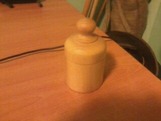
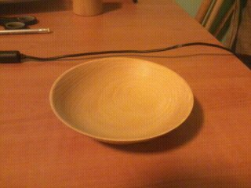
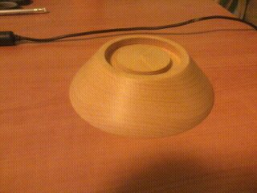
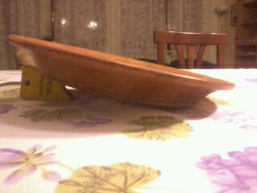
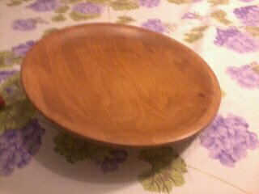
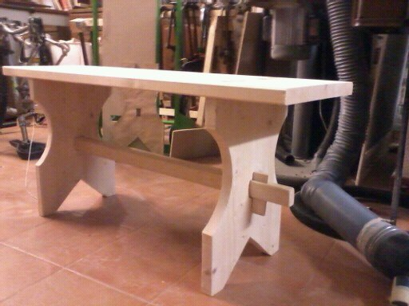

## Chi sono

Mi chiamo **Luca Ventrella**.

Sono un artigiano di Torino con la passione del legno.
Tutto è iniziato frequentando le scuole tecniche San Carlo,dove ho ottenuto la qualifica di  mobiliere.
Eseguo lavori di restauro, traforo, tornitura, verniciatura e laccatura,lavori in legno su misura  e creazioni varie.
In questa bottega non troverai solo i lavori di falegnameria ma anche di ripararioni biciclette, e su ogni lavoro  potrai richiedere informazioni.

## i miei Lavori

## Tornitura

	
	
	
	
	
	

## traforo

## Restauro

## Lavori vari

## Contattami

Contattami per preventivi e lavori scrivendo una email a [luca.ventrella@gmail.com](mailto:luca.ventrella@gmail.com).
